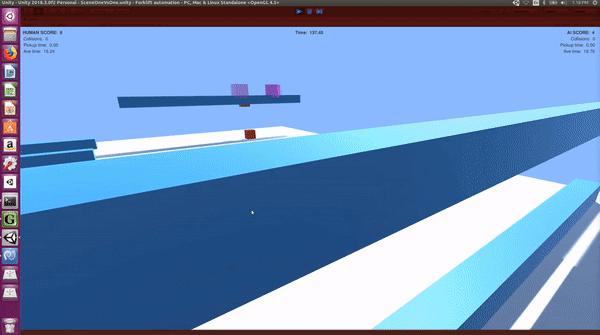
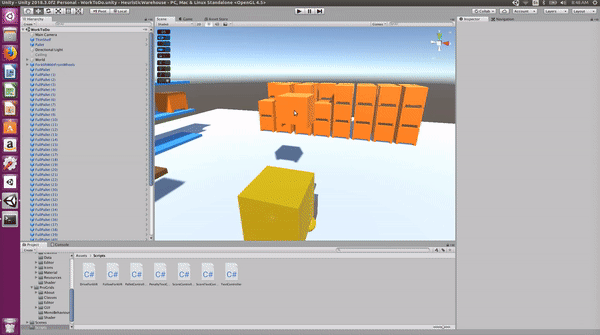
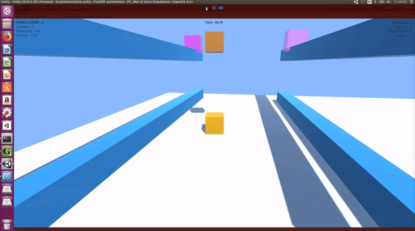
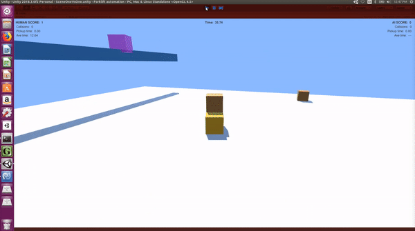

# auto-warehouse-v1.0
Simulation environment of warehouse for creating automation AI.

This code is written in C# for Unity3D game engine. This engine is perfect for simulating
real-world environments both visually and physically (emulate physical laws). Thorough testing
of ideas is necessary before deployment or implementation of automation processes.

## Link to youtube video of gameplay
https://youtu.be/pjHFhZs4xt4

---

## Examples

**Human-controllable players for testing and training**

Human-controllable players (yellow forklift) allow us to bug test our code as well as compete
against the computer algorithms to aid in the benchmarking process of the solutions. 
Human-controllable agents can also be used to train machine learning algorithms with a Unity3D
ML-Agents plugin.

**Various scenes and props for testing various functionality**

By designing different objects such as pallets, shelves, payloads, forklifts, conveyors, etc., 
and rendering them together, we can recreate the problems we face at work. Then, after creating
either hand-crafted solutions or implementing built-in Unity3D tools, we can automate the 
animation of the objects. 

**Collision and delivery tracking for model evaluation**

By tracking events such as collisions, deliveries, and transit time, we can evaluate different
automation algorithms in a standard environment before choosing one to implement.

**Multiple perspectives for easy inspection**

The simulation software must offer many different perspectives for the user to peer through,
in order to fully investigate the ideas being implemented.

---

## *Dependencies:*
 - Unity3D (not sure how new your version needs to be, but maybe 2017.1 and up)
 - Unity's NavMesh plugin (if you don't already have it by default)
 - (in the future) Unity's ML Agents plugin (not yet working on my setup)

## *How to use:*
 - Clone the project to your computer.
 - If you have Linux, you can download and run one of the executables built with these assets. 
 - Read the documentation and look at any videos I have made available on the Assets in the Assets folder.
 - Figure out which assets you are looking for (materials, forklift prefabs, control scripts, etc.)
 - Grab the assets that you think will best suit your needs and import it into your project's assets (drag and drop).
 - Try it out. If it isn't quite what you need, you can tweak some setting, write some code, or try another asset.

## *Assets available:*
 - Forklift assets such as full forklift prefabs, prefabs of just the forks, controller scripts, and materials as well as score controller scripts, UI text prefabs and controllers, and a camera controller script for following a forklift.
 - Pallet assets such as pallet prefabs, destination box prefabs, controller scripts, and materials.
 - Shelving assets such as shelf prefabs and pole prefabs (for building detailed shelves).
 - Scenes are not yet available but will be soon.
